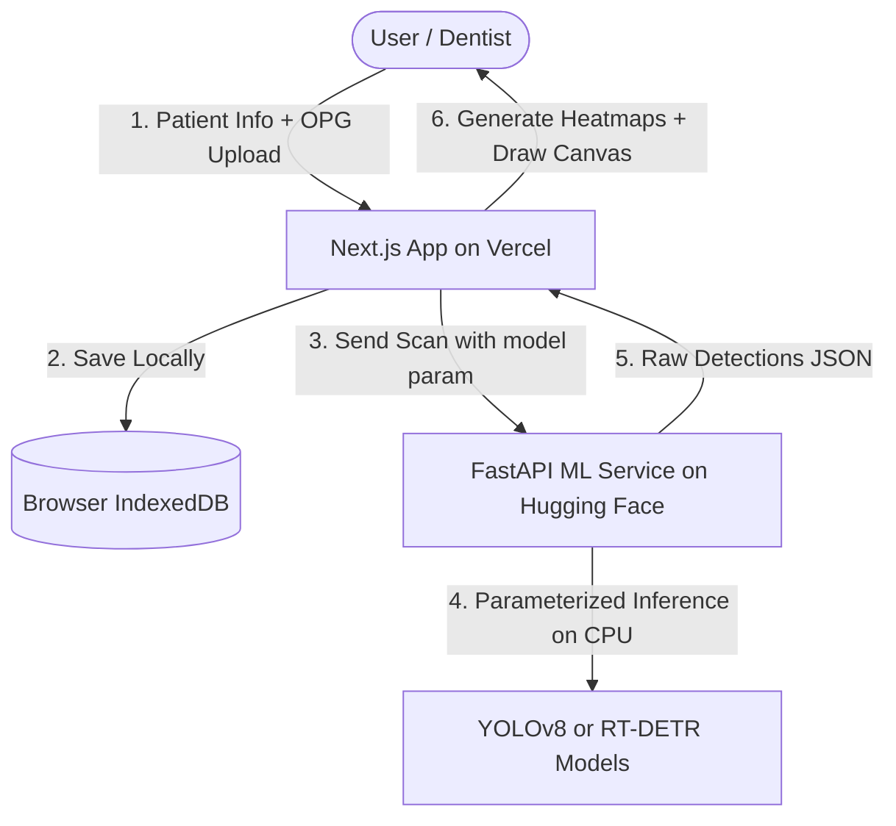

# DentalXNet: AI-Powered OPG Analysis System

DentalXNet is a web-based platform that analyzes panoramic dental radiographs (OPG X-rays) to detect and classify six categories of dental treatments. This design outlines a professional, full-stack, portfolio-grade project optimized for deployment on free tiers (Vercel + Hugging Face Spaces).

---

## 1. System Architecture & Privacy Design

To keep the application responsive, secure, and compliance-aware, we use a **decoupled client-server microservice architecture**:

### Privacy-Aware Design
- **Local-Only Metadata**: Patient identity details (Name, Age, Gender, Notes) are saved **locally in the dentist's browser** via IndexedDB. They are never sent to the ML backend or any cloud database.
- **In-Memory Scan Processing**: The FastAPI backend receives only the raw image, processes it in memory, and returns the response. It does not store the scan or results on any disk.

---

## 2. Platform Map & Upgraded Features

### Landing Page (Resume-Grade Showcase)
- **Hero Section**: Sleek dark-mode header with vibrant accents introducing *DentalXNet: AI-Powered OPG Analysis System*.
- **Key Metrics Panel**: Headline stats displaying the dataset size (2,235 scans), classes (6), final model precision (85.3%), and final mAP50 (71.3%).
- **Call To Action**: High-visibility "Launch Clinical Demo" button.
- **Project Journey**: Timeline visual detailing the experimental sequence (YOLOv8n → YOLOv8s → SE Attention Degradation → RT-DETR Transformer) showing research rigor.
- **Dataset Explorer**: Distribution visualization of the Mendeley OPG dataset (imbalance analysis of 6 classes).
- **Download Research Package**: Direct download of the compiled project PDF report, architecture sheet, and sample figures.

### Clinical Demo App
- **Patient Entry Form & Directory**: Save, review, search, and delete records locally in the browser's IndexedDB.
- **Dual-Model Inference (Fast API Optimization)**:
  - Default inference runs **RT-DETR** only.
  - Optional toggle to "Compare with YOLOv8 Baseline" triggers a second request with `?model=yolov8`, drawing comparisons side-by-side.
- **Interactive Vision Canvas**:
  - HTML5 Canvas overlays bounding boxes with real-time confidence filtering (0.1 to 0.9 slider).
  - Class-toggling checkboxes to show/hide specific classes.
  - Clicking on a bounding box shows a detail card with:
    - Detected Category & Confidence Score.
    - Educational Description (e.g. explaining the purpose of a dental implant, bridge, filling). *No medical diagnostic recommendations*.
- **Client-Side Heatmap Generator**: Generates heatmaps on the client canvas, allowing real-time adjustments of blur radius and intensity without contacting the server.
- **Clinical Report Generator**: One-click download of a professional patient report in PDF format containing scan overlays, patient details, and detection summaries.

---

## 3. Implementation Roadmap

### Phase 0: GitHub & Documentation First (Portfolio Foundations)
- [ ] Create repository-ready `README.md` with architectural diagrams, metrics tables, and setup instructions.
- [ ] Structure workspace directories.
- [ ] Extract and format training plots, confusion matrices, and model comparison metrics for frontend display.

### Phase 1: Core ML Microservice & Dashboard UI
- [ ] Set up the `backend/` FastAPI service.
  - Expose `/analyze?model=rtdetr|yolov8` and `/health` endpoints.
  - Load models dynamically on CPU using `ultralytics`.
  - Return raw JSON list of detections.
- [ ] Initialize the `frontend/` Next.js React workspace.
  - Create the layout, theme styling (dark, clinical, harmonious), and sidebar navigation.
  - Build the Landing Page (Metrics, Project Journey, Dataset Explorer, Technical Report).
  - Build the Scan Upload panel and the Canvas viewer (RT-DETR rendering, class toggles, confidence slider).
  - Implement client-side heatmap rendering.

### Phase 2: Patient Directory & Productivity Utilities
- [ ] Implement browser-side IndexedDB persistence for Patient Records.
- [ ] Develop the Patient Directory tab (table, search, record retrieval).
- [ ] Build the client-side PDF Clinical Report Generator.
- [ ] Add interactive click popups on bounding boxes containing Educational Descriptions.

### Phase 3: YOLO Comparison & Deployments
- [ ] Add side-by-side Comparison Mode (YOLOv8 baseline vs. RT-DETR).
- [ ] Implement the "Try Sample Scan" mode with preloaded OPG radiographs.
- [ ] Configure Hugging Face Space setup (Dockerfile and FastAPI entrypoint).
- [ ] Deploy frontend to Vercel.

---

## 4. Verification Plan

### Automated Verification
- **Frontend Build**: Run `npm run build` locally in Next.js to verify TypeScript and React compilation.
- **Backend Tests**: Run a mock verification request script `test_backend.py` to ensure local API endpoints respond correctly.

### Manual Verification
- **Core Loop**: Upload an OPG scan, observe RT-DETR detection boxes, adjust confidence slider, toggle specific classes, and view canvas-generated heatmaps.
- **Privacy Check**: Enter dummy patient details, run analysis, check the local storage/IndexedDB tab in Chrome DevTools to confirm data resides only in the client.
- **YOLO Comparison**: Toggle Comparison Mode and verify dual-canvas layout renders YOLOv8 alongside RT-DETR.
